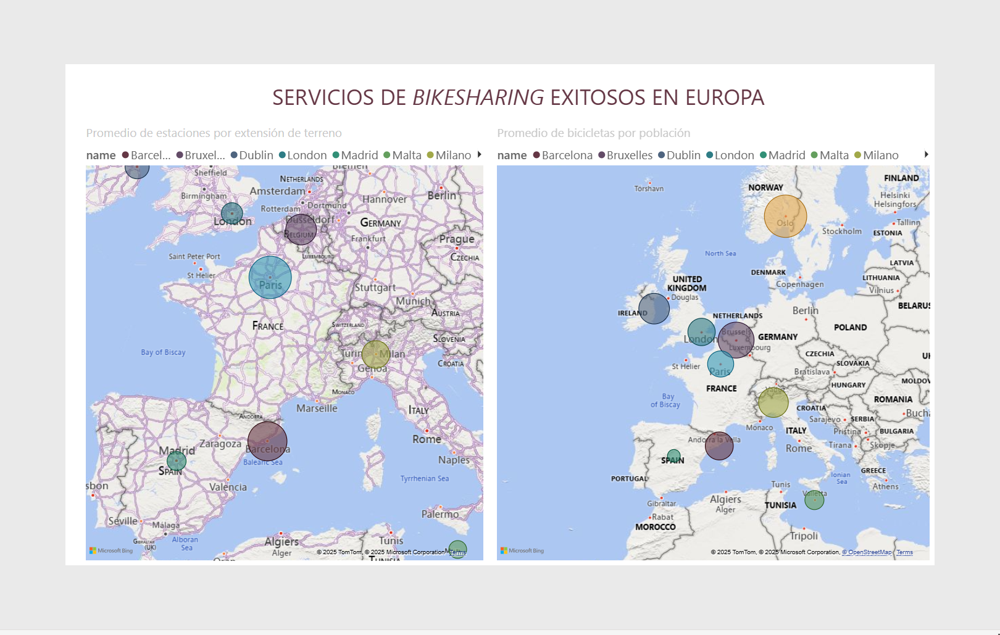
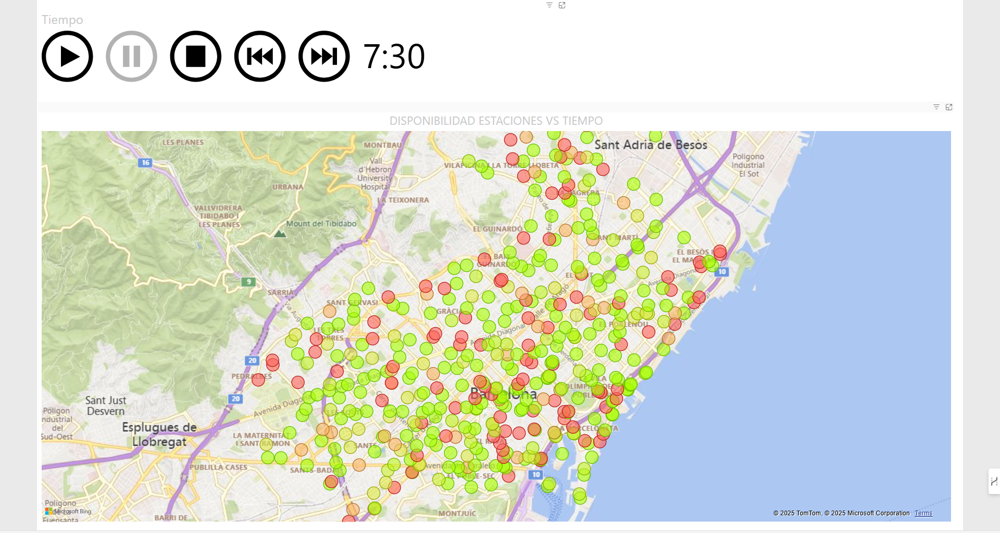
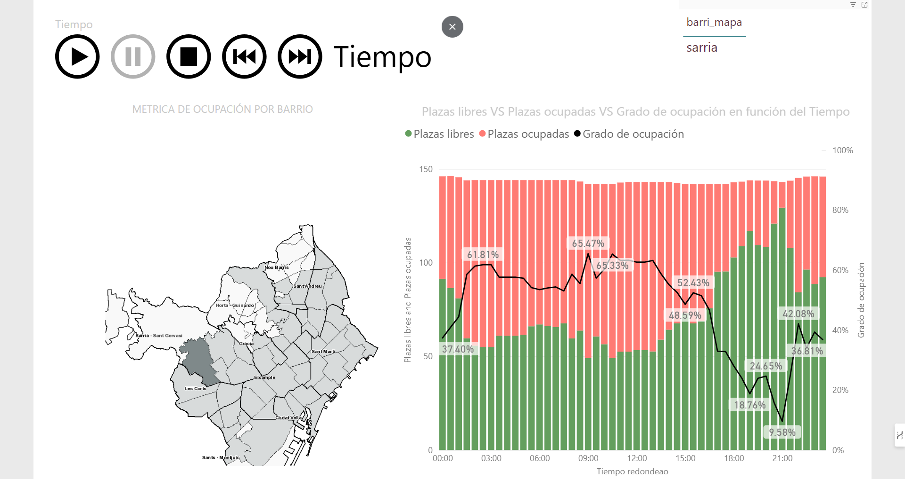

# 🚲 Bike-Sharing-Data-Insights

This project is a comprehensive approach to real-time data analysis for bike-sharing systems. It integrates Python for backend processes, SQL for managing the database, and Power BI for frontend data visualization. The data is sourced from [CityBik.es](https://citybik.es/), which provides global bike-sharing service information.

Currently, the system is configured to collect and process real-time data from the **Bicing** service in Barcelona. The data includes both real-time availability and historical information, which is processed and analyzed to derive valuable insights. To extend functionality to other bike-sharing services, modifications to the Python scripts will be necessary.

## 🗂️ Table of Contents

- [Features](#features)
- [Tech Stack](#tech-stack)
- [Data Insights](#data-insights)
- [Folder Overview](#folder-overview)
- [Database Structure](#database-structure)
- [Python Scripts Overview](#python-scripts-overview)
- [Acknowledgements](#acknowledgements)

---

## ⚙️ Features

- **Real-Time Data Extraction:** Python scripts pull live data from CityBik.es using their API.
- **Historical Data Analysis:** Processes historical bike-sharing data to uncover trends.
- **Data Storage:** Utilizes a MySQL database with a well-defined schema.
- **Interactive Dashboards:** Power BI dashboards provide intuitive visualizations of the analyzed data.
- **Extensibility:** Easily configurable Python scripts and database schema to support additional bike-sharing services.

---

## 🛠️ Tech Stack

- **Backend:** Python
- **Database:** MySQL
- **Data Source:** CityBik.es API
- **Frontend:** Power BI

Python and SQL scripts are modular and well-documented for ease of maintenance and extensibility.

---

## 📊 Data Insights

The following dashboards have been created to provide actionable insights:

1. **European Bike-Sharing Expansion:**
   Shows the growth of bike-sharing services across Europe, including metrics like stations per terrain area and bikes per population.
   
2. **Bike Availability by Station and Time of Day:**
   Analyzes average bike availability across different stations throughout the day.
   
3. **Neighborhood-Based Availability Trends:**
   Displays availability trends across various neighborhoods to identify patterns and anomalies.
   

*More visualizations are available in the Power BI report file or at the provided official url.*

---

## 🗂️ Folder Overview

### 📂 /data

This folder contains the source datasets used in the project.

- **citybik_bicing_sample.json:** A sample dataset extracted from CityBik.es.

---

### 📂 /images

This folder is reserved for future visualizations or documentation images.

---

### 📂 /reports

This folder contains generated reports and dashboards.

- **Bike-Sharing-Data-Insights.pbix:** Power BI report containing various data insights.

---

### 📂 /src

This folder contains the source code for data extraction, transformation, and database management.

#### 🐍 /python_scripts

Python scripts that handle interactions with the CityBik.es API and subsequent data processing.

- **tempo.py:** Executes the function `escriu_a_mysql()` to store each snapshot of the API data into the database, ensuring only new information is added.
- **station_info.py:** Extracts static information about each station (e.g., address, coordinates) and saves it as a `.csv` file for SQL import.
- **nearby_info.py:** Generates a `.csv` file that lists nearby stations and their relationships.

#### 🗂️ /sql

SQL scripts to manage the database structure and perform data analysis.

---

## 🏛️ Database Structure

The database is normalized and structured to handle historical and real-time bike-sharing data efficiently. The key tables include:

- **json_data:** Stores raw data retrieved from the CityBik.es API, representing data from December 17 to 22, 2017.
- **temp_info:** Contains processed data reflecting time-based changes, specifically from December 21 and 22, 2017.
- **station_info:** Includes static details such as station names, addresses, and coordinates.
- **nearby_stations:** Captures relationships between nearby stations, using the relationship as a primary key.
- **barris:** Links stations to their respective neighborhoods for location-based analysis.
- **cities:** A reference table storing information about other bike-sharing services worldwide.

---

## 🐍 Python Scripts Overview

The Python scripts play a crucial role in collecting, processing, and storing the data:

- **tempo.py:** Collects time-based availability data and stores it in the MySQL database after ensuring that the data has changed since the last update.
- **station_info.py:** Extracts and stores static information about bike stations in a `.csv` format.
- **nearby_info.py:** Analyzes station proximity and generates a `.csv` file containing these relationships.

These scripts collectively ensure that both static and dynamic data are accurately captured and processed for analysis.

---

## 🙌 Acknowledgements

Many thanks to my workmates **Nil** and **Marc Roig** for their support and contributions to this project.

Special thanks to [CityBik.es](https://citybik.es/) for providing access to their global bike-sharing service data.
